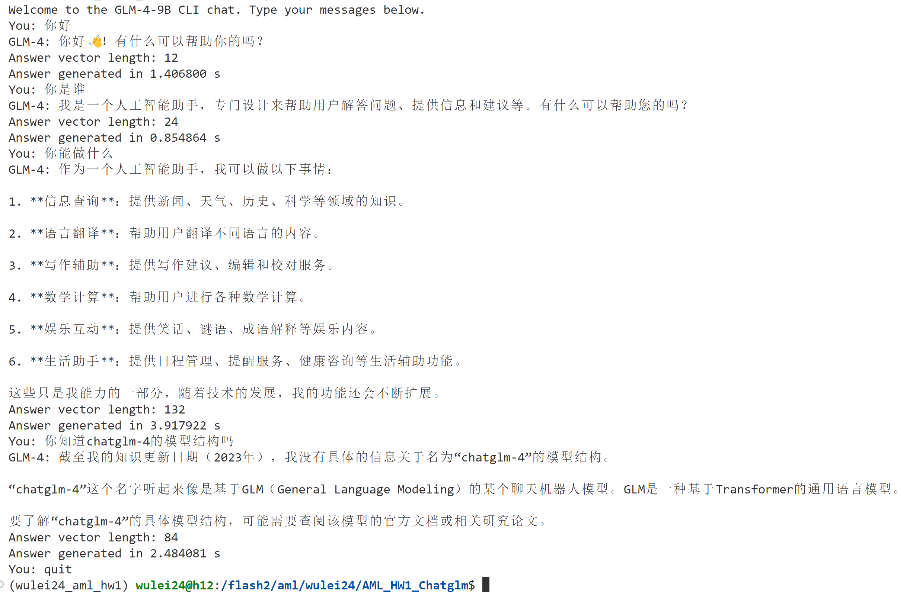
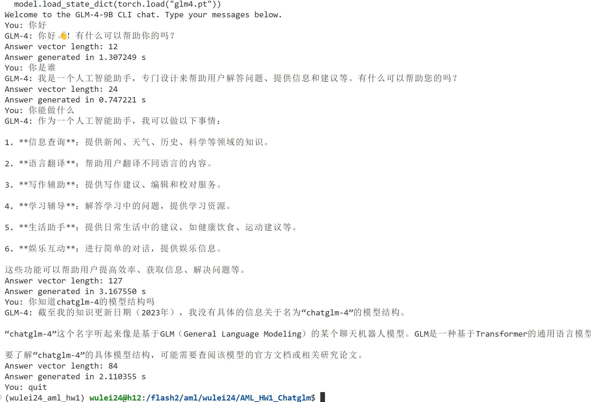

# 
AML HW1

吴垒 2024210897

## 功能实现情况
- [x] 基础代码实现
- [x] checkpoint加载
- [x] flash attention
- [x] 实验报告

## 文献调研过程
* 论文调研：
  * ChatGLM: A Family of Large Language Models from GLM-130B to GLM-4 All Tools
* 网络文献查找
  * https://zhuanlan.zhihu.com/p/669071548
  * https://zhuanlan.zhihu.com/p/379722366
  * https://blog.csdn.net/xxue345678/article/details/140005590
* 网络代码参考
  * https://huggingface.co/THUDM/glm-4-9b-chat/blob/main/modeling_chatglm.py
  * https://github.com/THUDM/GLM-4/blob/main/basic_demo/trans_cli_demo.py

## 代码实现方式
### `RMSNorm` 模块
`RMSNorm` 是一种归一化技术，基于 Root Mean Square (RMS) 方法对输入进行归一化。以下是模块的实现细节及逻辑分解：
1. **初始化 (`__init__`)**:
   - **参数**:
     - `normalized_shape`: 表示需要归一化的张量形状。
     - `eps`: 用于防止分母为零的小常数。
     - `device` 和 `dtype`: 确保权重张量的设备和数据类型与输入一致。
   - **定义权重参数**:
     - 使用 `torch.nn.Parameter` 定义一个可学习参数 `weight`，其形状与 `normalized_shape` 相同。

2. **前向传播 (`forward`)**:
   - **计算均方值**:
     - 对输入张量的最后一个维度（通常是特征维度）计算均方值（RMS）。
     - 将张量类型临时转换为 `float32` 以提升数值稳定性。
     - 使用 `pow(2).mean(-1, keepdim=True)` 计算最后一维的均方值。
   - **归一化**:
     - 使用 `torch.rsqrt(rms + self.eps)` 计算 RMS 的反平方根，加入 `eps` 保证数值稳定。
     - 将输入张量按该值缩放，实现归一化。
   - **重加权**:
     - 将归一化后的张量按可学习参数 `weight` 缩放。
     - 使用 `.to(in_type)` 将数据类型还原为输入的原始类型。

3. **核心逻辑**:
   - 归一化采用 RMS (Root Mean Square) 而非标准的均值与方差归一化。
   - 简化了计算流程并提升了计算效率，同时通过 `weight` 参数保留可学习性。

### `Attention` 模块
`Attention` 是深度学习中常见的注意力机制模块，用于处理序列数据，以下是模块的详细解释：
#### 1. **初始化 (`__init__`)**:
- **配置参数 (`config`)**:
  - `kv_channels` 和 `num_attention_heads` 定义了注意力头的数量和每个头的通道数。
  - `projection_size`: 每个分区的隐藏层大小，为 `kv_channels * num_attention_heads`。
- **计算维度**:
  - `hidden_size_per_attention_head`: 每个注意力头的隐藏维度。
  - `hidden_size_per_partition` 和 `num_attention_heads_per_partition`: 支持多设备分区。
- **归一化因子 (`norm_factor`)**:
  - 用于标准化注意力分数，值为 `sqrt(hidden_size_per_attention_head)`。
  
#### 2. **前向传播 (`forward`)**:
- **输入格式**:
  - 输入的 `query_layer`、`key_layer`、`value_layer` 张量形状为 `[batch, num_heads, seq_len, hidden_size_per_head]`。
  - `attention_mask` 用于控制注意力的计算范围（如因果遮掩）。
- **步骤**:
  1. **调整维度**:
     - 将 `query_layer` 和 `key_layer` 重新调整形状，方便进行矩阵运算。
     - 目标形状为 `[batch * num_heads, seq_len, hidden_size_per_head]`。
  2. **计算注意力分数 (`attention_scores`)**:
     - 利用 `torch.baddbmm` 进行批量矩阵乘法计算注意力分数。
     - 对 `query` 和 `key` 转置后进行点积操作，同时归一化分数。
     - 注意力分数的形状为 `[batch, num_heads, seq_len, seq_len]`。
  3. **处理注意力遮掩 (`attention_mask`)**:
     - 当 `attention_mask` 为 `None` 时，为自回归模型生成一个下三角遮掩矩阵。
     - 将遮掩的分数设置为负无穷大 (`-inf`)，从而排除无效位置。
  4. **计算注意力概率 (`attention_probs`)**:
     - 对注意力分数使用 `softmax`，将其转换为概率分布。
  5. **上下文向量 (`context_layer`)**:
     - 将注意力概率与 `value_layer` 矩阵相乘，得到上下文表示。
     - 上下文向量经过转置和调整形状，最终返回为 `[batch, seq_len, hidden_size]`。
     - 
#### 3. **核心逻辑**:
- **归一化与遮掩**:
  - 使用归一化因子 (`norm_factor`) 保证稳定性。
  - 自回归模型利用因果遮掩控制时间步的依赖性。
- **多头注意力的并行计算**:
  - 模块通过扩展维度和批量矩阵运算高效地实现了多头注意力。
- **动态形状调整**:
  - 在计算过程中灵活调整张量形状

### `FlashAttention` 模块
`FlashAttention2` 是改进版的注意力机制实现，基于 `Attention` 类进行扩展，专为高效计算和适应动态长度序列设计。以下是模块的实现分析：
#### 1. **初始化 (`__init__`)**:
- **继承父类功能**:
  - 继承 `Attention` 模块的所有配置和方法。
- **版本兼容性**:
  - `_flash_attn_uses_top_left_mask` 标识是否使用顶左遮掩方式，依据底层 `FlashAttention` 的版本 (`<2.10`) 决定。

#### 2. **前向传播 (`forward`)**:
- **输入调整**:
  - 对 `query_states`、`key_states` 和 `value_states` 的维度进行调整，使其形状适配 Flash Attention 的计算需求。
- **遮掩机制**:
  - 对因果遮掩 (`causal`) 逻辑进行优化，针对不同输入长度（如 `query_length == 1`）进行动态处理。
- **两种计算路径**:
  1. **有遮掩的计算**:
     - 使用 `_upad_input` 方法对输入进行“去填充”处理，提取有效的序列部分以提升计算效率。
     - 调用 `flash_attn_varlen_func` 计算非填充部分的注意力分数。
     - 最后通过 `pad_input` 方法将输出恢复为原始填充形状。
  2. **无遮掩的计算**:
     - 调用 `flash_attn_func` 直接计算注意力分数。
- **输出调整**:
  - 将注意力输出 (`attn_output`) 的形状恢复为 `[batch_size, query_length, hidden_size]`，并确保数据连续性。

#### 3. **辅助方法 (`_upad_input`)**:
- **功能**:
  - 对输入张量进行去填充操作，移除无效的填充值。
  - 生成必要的元信息（如索引和序列长度）以支持后续的动态计算。
- **逻辑**:
  1. **从遮掩矩阵提取有效信息**:
     - `_get_unpad_data` 计算填充索引、累积序列长度和批次内最大序列长度。
  2. **调整张量形状**:
     - 根据提取的索引调整 `key_layer` 和 `value_layer` 的形状，使其仅包含有效序列部分。
  3. **处理 `query_layer`**:
     - 针对 `query_length` 的不同情况（如与 `kv_seq_len` 相等或为 1），动态调整。
     - 生成累积序列长度 (`cu_seqlens_q`) 和序列索引 (`indices_q`)。
  4. **返回值**:
     - 返回去填充后的 `query_layer`、`key_layer`、`value_layer` 及相关元信息。

#### 4. **核心逻辑与优势**:
- **优化计算效率**:
  - 利用去填充处理减少无效计算，提升性能，尤其适合长序列或动态长度场景。
- **动态遮掩支持**:
  - 对因果遮掩和序列长度适配性进行了全面优化，确保兼容多种任务需求。
- **与 Flash Attention 集成**:
  - 结合底层高效注意力实现 (`flash_attn_func` 和 `flash_attn_varlen_func`)，显著提升 GPU 加速性能。

### `AttentionBlock` 模块
`AttentionBlock` 是一个并行的自注意力层，设计用于高效处理序列输入，并支持多查询注意力 (`multi-query attention`) 和旋转位置嵌入 (`rotary positional embedding`)。以下是模块的实现解析：
#### 1. **初始化 (`__init__`)**:
- **核心参数定义**:
  - `projection_size`: 每个注意力头的总隐藏大小。
  - `hidden_size_per_attention_head`: 单个注意力头的隐藏维度大小。
  - `qkv_hidden_size`: 包含 `query`、`key`、`value` 的总维度。
- **支持多查询注意力**:
  - 如果启用 `multi-query attention`，`qkv_hidden_size` 的计算会有所变化，用于处理多个组的 `key` 和 `value`。
- **子模块**:
  - `query_key_value`: 投影输入 `hidden_states` 到 `qkv_hidden_size`。
  - `core_attention`: 主体注意力机制，由 `Attention` 实现。
  - `dense`: 输出层，用于将注意力输出映射回原始隐藏大小。

#### 2. **前向传播 (`forward`)**:
- **步骤**:
  1. **QKV 计算**:
     - 使用 `query_key_value` 生成混合的 `query`、`key` 和 `value`。
     - 对多查询注意力和常规注意力分别处理:
       - **多查询注意力**: 
         - 通过 `split` 提取 `query` 和按多查询组划分的 `key` 和 `value`。
         - 调整形状以适配多查询组头数。
       - **常规注意力**: 
         - 直接调整形状并划分为 `query`、`key`、`value`。
  2. **旋转位置嵌入**:
     - 如果提供 `rotary_pos_emb`，对 `query` 和 `key` 应用旋转位置编码。
  3. **缓存机制 (`kv_cache`)**:
     - 如果提供缓存，拼接现有 `key` 和 `value` 以支持增量解码。
     - 根据需求生成或更新新的 `kv_cache`。
  4. **多查询注意力扩展**:
     - 将多查询组的 `key` 和 `value` 复制扩展到所有注意力头，使其能够兼容标准多头注意力计算。
  5. **核心注意力计算**:
     - 调用 `core_attention` 处理 `query`、`key`、`value` 和遮掩矩阵 (`attention_mask`)。
     - 输出上下文层 (`context_layer`)。
  6. **输出映射**:
     - 使用 `dense` 将 `context_layer` 映射回 `[sequence_length, batch_size, hidden_size]`。
- **返回值**:
  - 模块返回两个值:
    1. 输出 (`output`): 处理后的序列表示。
    2. 新的缓存 (`new_kv_cache`): 用于增量解码的 `key` 和 `value` 缓存。

#### 3. **核心功能分析**:
- **多查询注意力**:
  - 减少 `key` 和 `value` 的计算开销，通过共享权重优化性能。
- **旋转位置嵌入**:
  - 提供更好的位置表示能力，适合更长的上下文。
- **缓存支持**:
  - 增量缓存机制使其适配生成任务（如 GPT 解码）。
- **并行计算**:
  - 通过扩展和调整输入形状，优化多头注意力的计算效率。

### `MLP` 模块
`MLP` 是一个全连接层模块，用于 Transformer 模型中的前馈神经网络部分。该模块将输入的隐藏状态投影到更高维度空间进行非线性变换后，再投影回原始维度。
#### 1. **初始化 (`__init__`)**:
- **核心参数与层定义**:
  - `dense_h_to_4h`: 
    - 将输入隐藏状态从 `h` 维投影到 `4*h` 的中间维度空间。
    - 输出的维度是 `config.ffn_hidden_size * 2`，因为后续使用 `SwigLU` 激活函数对数据进行拆分和非线性变换。
  - `dense_4h_to_h`: 
    - 将中间维度投影回输入维度 `h`，完成 MLP 的最后一步。
- **使用的数据类型**:
  - 支持自定义 `dtype`（如 `torch.bfloat16`）以提高计算效率。

#### 2. **前向传播 (`forward`)**:
- **步骤**:
  1. **第一层线性投影**:
     - 使用 `dense_h_to_4h` 将输入 `hidden_states` 投影到一个更高的维度（`4*h`）。
  2. **激活函数与非线性变换**:
     - 调用 `_swiglu` 函数，对 `intermediate_output` 进行 SwigLU 激活。
     - SwigLU 的实现通过以下步骤：
       - 将输入张量沿最后一维分成两部分。
       - 第一部分通过 `Silu` 激活函数，第二部分直接保留。
       - 两部分相乘得到非线性变换结果。
  3. **第二层线性投影**:
     - 使用 `dense_4h_to_h` 将非线性变换后的结果映射回原始维度 `h`。
  4. **返回结果**:
     - 输出经过两次投影和非线性变换后的张量。

#### 3. **核心功能分析**:
- **维度扩展与压缩**:
  - 通过中间维度的扩展 (`4*h`) 提供更大的表达能力。
  - 压缩回原始维度确保模块输出与输入形状一致。
- **非线性变换**:
  - 使用 `SwigLU` 替代传统的 `ReLU` 或 `GELU`，提供更好的梯度流动性和计算效率。
- **线性映射高效性**:
  - 两个线性层操作简单高效，易于并行化。

### `Layer` 模块
### 模块实现说明
`Layer` 是一个完整的 Transformer 层模块，包含自注意力机制和前馈神经网络 (MLP)，通过规范化和残差连接实现高效的深度学习特征提取。
#### 1. **初始化 (`__init__`)**:
- **核心子模块**:
  1. **`AttentionBlock`**:
     - 实现自注意力机制，用于捕获全局依赖关系。
     - 参数来自 `config`，支持不同的设备和数据类型。
  2. **输入和输出层归一化 (`RMSNorm`)**:
     - 使用均方根归一化代替传统的 LayerNorm，提高计算效率。
     - 两个归一化模块分别处理输入和注意力后的隐藏状态。
  3. **`MLP`**:
     - 执行前馈神经网络的非线性变换，用于增强模型的表达能力。
- **数据类型支持**:
  - 支持 `bfloat16` 和 `float32` 数据类型，通过配置灵活选择。

#### 2. **前向传播 (`forward`)**:
- **输入**:
  - `hidden_states`: 输入的隐藏状态张量，形状为 `[sequence_length, batch, hidden_size]`。
  - `attention_mask`: 掩码矩阵，用于忽略特定位置的注意力计算。
  - `rotary_pos_emb`: 旋转位置编码，用于增强自注意力的相对位置感知能力。
  - `kv_cache`: 键值缓存，用于加速自回归任务（如生成任务）。
  - `use_cache`: 是否启用键值缓存。
- **步骤**:
  1. **输入归一化**:
     - 对输入的 `hidden_states` 应用 `input_layernorm`。
  2. **自注意力机制**:
     - 调用 `self_attention` 模块，处理归一化后的隐藏状态，计算注意力输出和新的键值缓存。
     - 将注意力输出添加到原始输入，实现残差连接，形成 `layernorm_input`。
  3. **输出归一化**:
     - 对 `layernorm_input` 应用 `output_layernorm`。
  4. **前馈神经网络**:
     - 调用 `MLP` 模块，对归一化后的输出进一步处理。
     - 将 MLP 输出与 `layernorm_input` 相加，形成最终的输出。
  5. **返回结果**:
     - 返回更新后的隐藏状态 `output` 和新的键值缓存 `new_kv_cache`。

#### 3. **核心功能分析**:
- **残差连接**:
  - 将每个子模块的输出与输入相加，缓解深度模型的梯度消失问题，便于优化。
- **归一化策略**:
  - 使用 `RMSNorm` 提高训练稳定性，并减少计算开销。
- **分层处理**:
  - 自注意力模块关注全局依赖，MLP 模块增强局部特征处理能力。
- **位置编码支持**:
  - 支持旋转位置编码（`rotary_pos_emb`），增强模型对序列位置的感知能力。
- **缓存机制**:
  - 在生成任务中，利用 `kv_cache` 减少重复计算，提高生成效率。

### `Transformer` 模块
`Transformer` 是一个完整的 Transformer 模型，由多层 Transformer 层 (`Layer`) 堆叠而成，支持键值缓存、层后归一化等功能，适用于编码器或解码器任务。
#### 1. **初始化 (`__init__`)**:
- **核心结构**:
  1. **`num_layers`**:
     - 由配置文件 `config` 确定 Transformer 层的数量。
  2. **`layers`**:
     - 使用 `nn.ModuleList` 组织多个 `Layer` 模块（每层都是独立的子网络）。
  3. **`post_layer_norm`**:
     - 如果配置启用，添加输出层归一化模块 (`RMSNorm`) 来对最终的隐藏状态进行归一化处理。
- **数据类型支持**:
  - 支持 `bfloat16` 和 `float32` 数据类型，配置灵活。

#### 2. **前向传播 (`forward`)**:
- **输入**:
  - `hidden_states`: 输入隐藏状态，形状为 `[sequence_length, batch_size, hidden_size]`。
  - `attention_mask`: 掩码矩阵，用于屏蔽特定位置的注意力计算。
  - `rotary_pos_emb`: 旋转位置编码，用于增强相对位置感知能力。
  - `kv_caches`: 每层的键值缓存（如果存在）。
  - `use_cache`: 是否启用键值缓存（生成任务时通常为 `True`）。
  - `output_hidden_states`: 是否返回所有中间隐藏状态（调试或分析用途）。
- **主要步骤**:
  1. **初始化缓存**:
     - 如果未提供 `kv_caches`，为每一层初始化空缓存。
     - 准备存储新的键值缓存 (`present_key_values`) 和所有中间隐藏状态 (`all_hidden_states`)。
  2. **逐层处理**:
     - 遍历每个 Transformer 层 (`Layer`)，将隐藏状态传递到每层中处理。
     - 如果启用了键值缓存 (`use_cache`)，将当前层的键值缓存存储到 `present_key_values`。
     - 如果启用了中间隐藏状态输出 (`output_hidden_states`)，将当前层的隐藏状态存储到 `all_hidden_states`。
  3. **后归一化**:
     - 如果启用了 `post_layer_norm`，对最终的隐藏状态应用归一化操作。
  4. **输出**:
     - 返回最终的隐藏状态 `hidden_states` 和更新后的键值缓存 `new_kv_caches`。

#### 3. **关键功能分析**:
- **层迭代 (`layers`)**:
  - 通过 `nn.ModuleList` 动态存储并调用每一层。
  - 通过 `_get_layer` 方法实现按层访问。
- **键值缓存 (`kv_caches`)**:
  - 提供缓存机制，支持生成任务中高效的序列化处理，避免重复计算历史信息。
  - 键值缓存的更新机制基于每层的输出缓存 (`present_kv_cache`)。
- **中间状态输出**:
  - `output_hidden_states` 可选地返回所有层的隐藏状态，便于调试和分析。
- **后归一化 (`post_layer_norm`)**:
  - 在模型输出阶段增加稳定性，规范化隐藏状态分布。

### `convert_ckpt` 函数
`convert_ckpt` 函数用于转换预训练模型的权重文件，将 Hugging Face 格式的权重映射到自定义格式并保存为 `.pt` 文件。
#### 1. **加载预训练模型**
- 使用 `AutoModelForCausalLM.from_pretrained` 方法加载 Hugging Face 格式的预训练语言模型。
- 参数说明：
  - `torch_dtype=torch.bfloat16`：将模型的权重加载为 `bfloat16` 类型以节省内存。
  - `low_cpu_mem_usage=True`：优化内存使用，在加载大模型时避免占用过多 CPU 内存。
  - `trust_remote_code=True`：允许加载包含自定义代码的模型。
  - `device_map="auto"`：将模型自动分配到适当的设备（如 GPU 或 CPU）。
- 调用 `.eval()` 切换模型为推理模式，禁用梯度计算以提高推理效率。

#### 2. **提取权重 (`state_dict`)**
- 使用 `state_dict()` 提取 Hugging Face 模型的权重字典。
- `model_dict` 中的键为参数名称，值为相应的张量。

#### 3. **权重名称映射**
- 初始化一个空字典 `new_model_dict` 用于存储重命名后的权重。
- 遍历 `model_dict`：
  - 通过 `.replace` 方法修改键名，将 Hugging Face 格式的命名映射到自定义命名：
    - `"encoder"` → `"model"`：将通用的编码器命名替换为自定义模型名称。
    - `"final_layernorm"` 和 `"post_attention_layernorm"` → `"output_layernorm"`：将归一化层的命名统一化。
    - `"embedding.word_embeddings"` → `"word_embedding"`：映射词嵌入层的名称。
- 重命名后的键和值存入 `new_model_dict`。

#### 4. **保存转换后的权重**
- 使用 `torch.save` 方法将 `new_model_dict` 保存为 `glm4.pt` 文件。
- 保存的文件可用于自定义加载逻辑或替代 Hugging Face 加载方式。

### `main` 函数
`main`函数为模拟`github`仓库交互逻辑的一个交互函数模块，以下是该模块的实现方式，涉及自定义停止条件、模型加载与推理流程，以及一个命令行聊天界面。

#### 1. **自定义停止条件：`StopOnTokens`**
- 继承自 `StoppingCriteria`，用于在生成过程中检测是否需要停止。
- 判断逻辑：
  - 使用 `generation_config.eos_token_id` 中的终止标记 (`stop_ids`)。
  - 如果当前生成的最后一个 `input_id` 等于任何一个 `stop_id`，停止生成。
- 主要作用：
  - 确保生成的内容在遇到预定义的终止标记后停止，以避免无意义的生成。

#### 2. **模型加载**
- 设置 GPU 使用环境：
  - `os.environ['CUDA_VISIBLE_DEVICES']` 指定 GPU 编号。
  - 自动检测设备，优先使用 CUDA (`"cuda"`)，否则使用 CPU。
- 加载预训练模型和权重：
  - 使用 `AutoTokenizer` 加载对应的分词器。
  - 初始化模型为 `ChatGLMForConditionalGeneration`，并加载转换后的权重文件 `glm4.pt`。
  - 设置 `generation_config` 为生成参数的配置对象。

#### 3. **生成参数 (`generation_config`)**
- 包括以下关键生成参数：
  - `eos_token_id`: 终止标记列表，用于控制生成结束。
  - `pad_token_id`: 填充标记，用于对齐序列。
  - `do_sample`: 是否进行随机采样生成。
  - `temperature`: 控制生成多样性的参数。
  - `max_new_tokens`: 生成的最大新标记数。
  - `top_p` 和 `top_k`: 用于控制生成概率分布的截断策略。
  - `transformers_version`: 指定支持的 `transformers` 版本。

#### 4. **命令行聊天交互**
- 接收用户输入并动态更新上下文对话历史。
- **对话历史管理**：
  - 使用 `history` 列表保存用户输入与模型生成的回复对。
  - 将对话转换为模型可用的输入格式（`messages`）。
- **输入格式化**：
  - 使用 `tokenizer.apply_chat_template` 将对话格式化为模型的输入模板，并生成相应的张量。
- **生成过程**：
  - 使用 `TextIteratorStreamer` 实现流式输出，逐步显示生成的标记。
  - 创建一个生成线程 (`Thread`)，以异步方式调用 `model.generate`。
  - 自定义停止条件通过 `StoppingCriteriaList([stop])` 实现。

#### 5. **实时生成与输出**
- 每个生成的标记会通过 `streamer` 实时输出。
- 首次生成时跳过初始的换行符（避免多余换行）。
- 将生成的标记逐步追加到当前对话的模型回复中。

#### 6. **命令行界面**
- 提供简单的聊天功能：
  - 输入 `exit` 或 `quit` 退出程序。
  - 用户输入将实时处理，并通过模型生成回复。
  - 将`max_length=100`改为`max_new_tokens=8192`以增加模型输出长度。
  - 若在运行时添加参数`-d`或`--detailed`，则模型将显示每次生成所需的时间及空间。

## 遇到困难
主要困难就是把一个变量名称写错，以至于输出向量全是统一的220，检查了将近9小时才发现。其余主要是花时间用于学习背景知识、了解网络架构，还有搭建服务器环境。

## 实验结果
实验截图如下：
运行`python run_glm4.py -d`并进行对话结果：

运行`python run_glm4_flash.py -d`并进行对话结果：

可以看到，当输入长度2（你好）时，输出时间加速比为$\frac{1.406800}{1.307249} \approx  1.08$。
当输入长度5（你能做什么）时，输出时间加速比为$\frac{3.917922}{3.167550} \approx  1.24$。
当输入长度18（你知道chatglm-4的模型结构吗）时，输出时间加速比为$\frac{2.484081}{2.110355} \approx 1.18$。
没有发现什么明显规律，也没发现输出的空间向量长度有明显不同（空间加速比接近1），感觉要么可能是`flash_attention`的实现有问题，要么可能是由于前后输入输出接口的自定义操作导致的测量时间波动。
